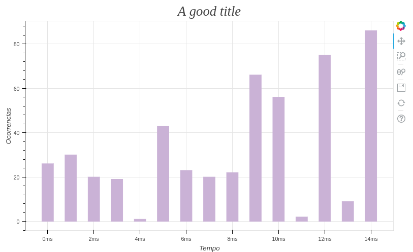

# Bokeh graph examples

Two simple graph examples (bar and plot) using bokeh and django in the back-end.

#### Enviroment

**Python version:** 3.6.4

**Django version:** 2.0.4

### Instalation

With python3 you can install the dependencies with `pip3 install -r requirements.txt`

### Running

1) First option<br>
```shell
sh run.sh
```

2) Second option<br>
```shell
python manage.py makemigrations
python manage.py migrate
python manage.py runserver
```

After step 1) or 2) the local server should be up at `http://0.0.0.0:8000/`

**The bar example**


